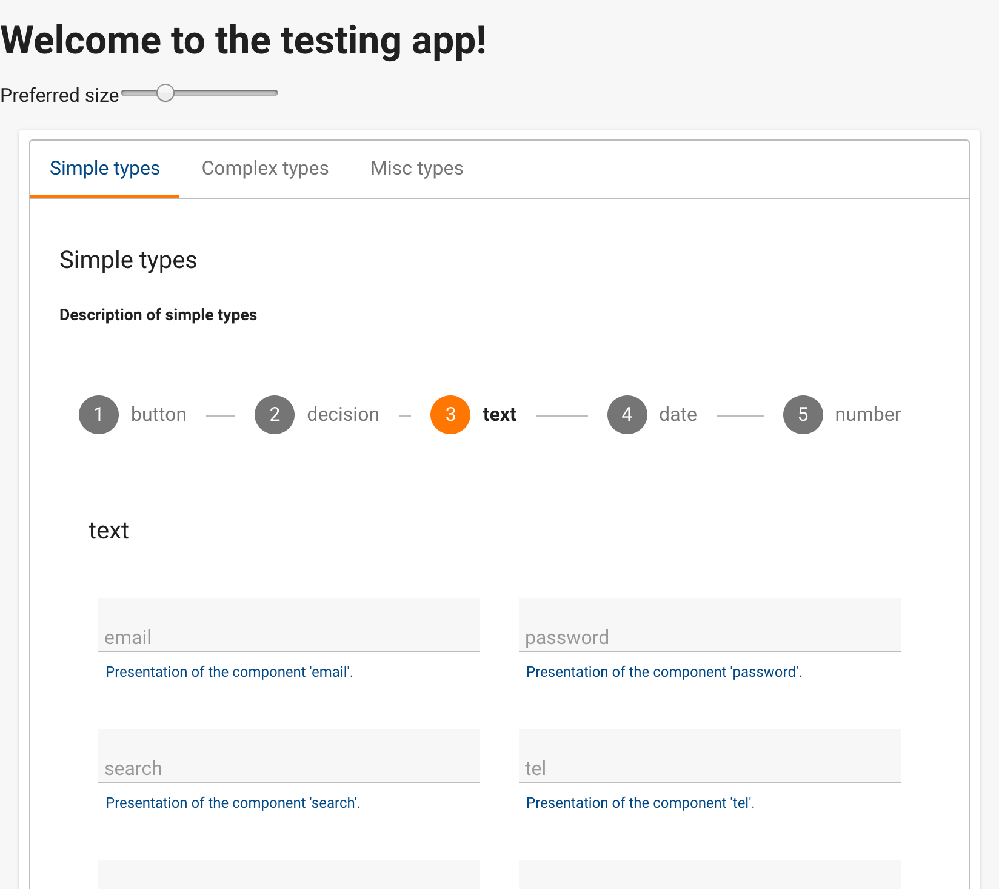

# UI Widgets PrimeNG Ultima

This lib provides widgets based on [PrimeNG](https://www.primefaces.org/primeng/#/) with theme [ULTIMA](https://www.primefaces.org/ultima-ng/#/).

This widget are used within a form generated by the [ngx-schema-form-view](https://github.com/daniele-pecora/ngx-schema-form-view) project.


## Preview

A tiny impression of a preview.
[Visit the LIVE DEMO](https://ngx-schema-form-widgets-ultima/) for more.

[](https://ngx-schema-form-widgets-ultima.web.app)

[See more preview images](./_preview/README.MD)


## Usage

Register the module `UiWidgetsPrimengModule` into your module declaration
and register the registry as provider

```angular2
    @NgModule({
      ...
      imports: [
        ...
          UiWidgetsPrimengModule
        ...
      ],
      providers: [
        {provide: WidgetRegistry, useClass: WidgetRegistryPrimeNG}
      ]
      ...
    })
```

## Widget Library Documentation

Head over to the [library documentation README.MD](documentation/README.md) (Not Yet :-( )

Unfortunately this projects lacks of a documentation.

To see how to use any of this widget head over to the source code of the widgets html templates

- [array](../projects/ngx-schema-form-widgets-ultima/src/lib/widgets/array/array.widget.html)
- [autocomplete](../projects/ngx-schema-form-widgets-ultima/src/lib/widgets/autocomplete/autocomplete.widget.html)
- [bbcode](../projects/ngx-schema-form-widgets-ultima/src/lib/widgets/bbcode/bbcode.widget.html)
- [button](../projects/ngx-schema-form-widgets-ultima/src/lib/widgets/button/button.widget.html)
- [captcha](../projects/ngx-schema-form-widgets-ultima/src/lib/widgets/captcha/captcha.widget.html)
- [checkbox](../projects/ngx-schema-form-widgets-ultima/src/lib/widgets/checkbox/checkbox.widget.html)
- [date](../projects/ngx-schema-form-widgets-ultima/src/lib/widgets/date/date.widget.html)
- [dialog](../projects/ngx-schema-form-widgets-ultima/src/lib/widgets/dialog/dialog.widget.html)
- [file](../projects/ngx-schema-form-widgets-ultima/src/lib/widgets/file/file.widget.html)
- [form](../projects/ngx-schema-form-widgets-ultima/src/lib/widgets/form/form.widget.html)
- [html](../projects/ngx-schema-form-widgets-ultima/src/lib/widgets/html/html.widget.html)
- [integer](../projects/ngx-schema-form-widgets-ultima/src/lib/widgets/integer/integer.widget.html)
- [message](../projects/ngx-schema-form-widgets-ultima/src/lib/widgets/message/message.widget.html)
- [messages](../projects/ngx-schema-form-widgets-ultima/src/lib/widgets/messages/messages.widget.html)
- [object](../projects/ngx-schema-form-widgets-ultima/src/lib/widgets/object/object.widget.html)
- [osm](../projects/ngx-schema-form-widgets-ultima/src/lib/widgets/osm/osm.widget.html)
- [progress](../projects/ngx-schema-form-widgets-ultima/src/lib/widgets/progress/progress.widget.html)
- [qrcode](../projects/ngx-schema-form-widgets-ultima/src/lib/widgets/qrcode/qrcode.widget.html)
- [radio](../projects/ngx-schema-form-widgets-ultima/src/lib/widgets/radio/radio.widget.html)
- [range](../projects/ngx-schema-form-widgets-ultima/src/lib/widgets/range/range.widget.html)
- [section](../projects/ngx-schema-form-widgets-ultima/src/lib/widgets/section/section.widget.html)
- [select](../projects/ngx-schema-form-widgets-ultima/src/lib/widgets/select/select.widget.html)
- [select-button](../projects/ngx-schema-form-widgets-ultima/src/lib/widgets/select-button/select-button.widget.html)
- [select-card](../projects/ngx-schema-form-widgets-ultima/src/lib/widgets/select-card/select-card.widget.html)
- [string](../projects/ngx-schema-form-widgets-ultima/src/lib/widgets/string/string.widget.html)
- [switch](../projects/ngx-schema-form-widgets-ultima/src/lib/widgets/switch/switch.widget.html)
- [table](../projects/ngx-schema-form-widgets-ultima/src/lib/widgets/table/table.widget.html)
- [textarea](../projects/ngx-schema-form-widgets-ultima/src/lib/widgets/textarea/textarea.widget.html)
- [wizard](../projects/ngx-schema-form-widgets-ultima/src/lib/widgets/wizard/wizard.widget.html)


## Development

To generate all `*.js`, `*.d.ts` and `*.metadata.json` files:

#### Live preview

Try it out in the demo app

```bash
$ ng build --prod ngx-schema-form-widgets-primeng-ultima
$ npm start
```

#### Build library

```bash
$ ng build --prod ngx-schema-form-widgets-primeng-ultima
```

or use the shortcut `npm run build:lib`


#### Deploy library

```bash
$ ng build --prod ngx-schema-form-widgets-primeng-ultima && \
  cd dist/ngx-schema-form-widgets-primeng-ultima && \
  npm pack \
  && cd -
```

or use the shortcut `$ npm run deploy:lib`


------------------------------------------------------


## Project upgrade

This project has been upgraded

For more detail see [UPGRADE.MD](./_readme/UPGRADE.MD) created in project directory


## **nucli** NPM Commands

This project was generated with [NUCLI](https://src.vois.org/hsh/inforegister/UI/ng-ultima-cli.git)

For a full list of NPM commands refer to the file [COMMANDS_README.MD](./_readme/COMMANDS_README.MD) created in the project directory


------------------------------------------------------
